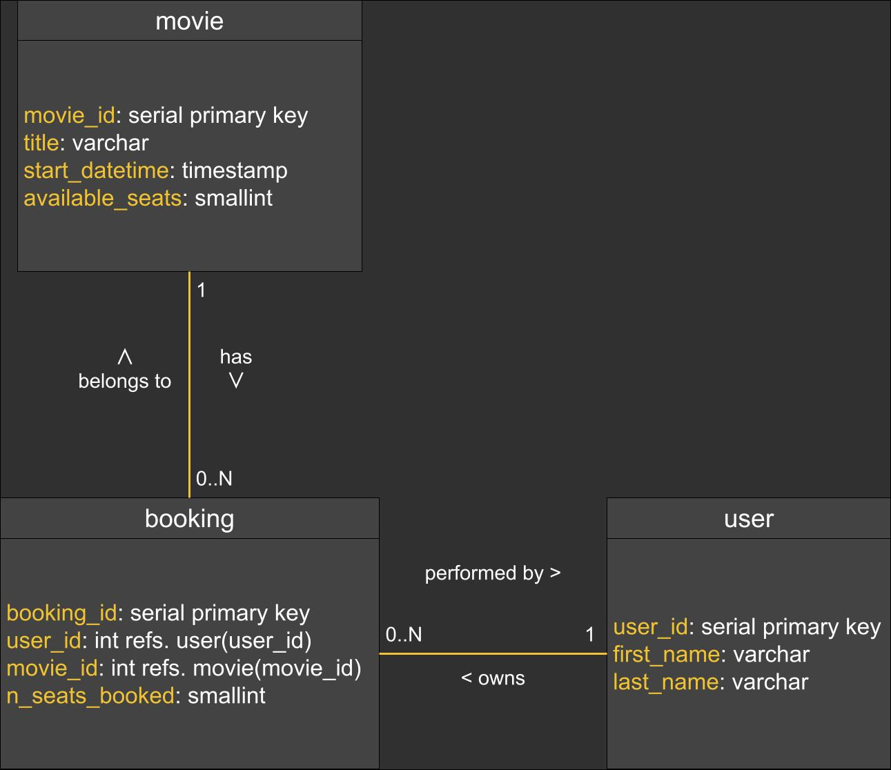

# Readme

## Intro

### About the project

The Movie Booking project is a small project written in Java, Spring Boot and SQL. It is a (very) approximated simulation of an API service for a movie theater. The available operation are 1. Fetching a list of all the movies in the program; 2. Booking of a movie; 3. Cancellation of a booking. 

### History and purpose of the project

This project was originally a code challenge that I was asked to solve by a company as part of their recruiting process. I had fun solving that code challenge and liked the idea of an API for a movie theater, so I decided to keep the code. As simple as that. 
I think it could be a good exercise to keep the project up-to-date with newer versions of the frameworks or libraries employed in the project, or new best practices that will come out. 
This is however limited by the free time I have, which is not much. This project is by no means a priority to me, but rather something that might indirectly motivate me to do more research about the latest trends in Java and Spring, and their future. 
Because I have full autonomy over the project, I also think that it will serve me as a nice sandbox for some new pattern or library that I may want to experiment with.

## Project type and architecture

This is a Maven-managed project that uses Spring Boot 3. It  and implements OpenAPI v3 (f.k.a. Swagger).

### How to run the application

The application has been written from the ground up with an API-first approach. All the API classes are generated by the [OpenAPI Generator Maven PLugin](https://github.com/OpenAPITools/openapi-generator/tree/master/modules/openapi-generator-maven-plugin) to automatically generate api and model, according to the attached design requirements in [REST API.pdf](REST%20API.pdf). 
Therefore, it is first of all necessary to run `mvn clean compile`. This will generate the API classes and compile the code. 
Running `mvn clean install` will do everything `compile` does, and in addition will run the Spring Boot application and execute the included integration tests.

### Database structure

The database structure is outlined in the following UML diagram:

